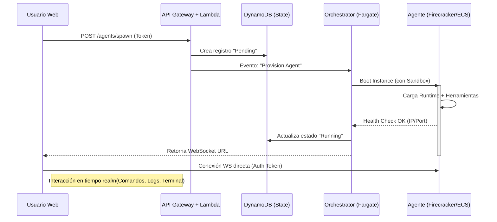

# Propuesta Técnica: OpenClaw Cloud (MVP)

> **Estado:** Draft
> **Autor:** Stratus (Cloud Architect)
> **Fecha:** 2026-01-31

## 1. High-Level Design

El siguiente diagrama ilustra el flujo de interacción desde que un usuario solicita una instancia hasta que el agente está operativo. El diseño prioriza la separación de control (Control Plane) y ejecución (Data Plane).

## 2. Tecnología de Aislamiento: Recomendación

Para el MVP, la prioridad es **balancear seguridad, coste y facilidad de implementación**.

### Opción A: AWS ECS (Fargate)
*   **Pros:** Gestión cero de servidores, integración nativa, seguridad por diseño (cada tarea tiene su kernel).
*   **Contras:** Tiempo de arranque "lento" (30-60s), coste mínimo fijo por tarea, difícil de pausar/reanudar instantáneamente.

### Opción B: AWS Lambda (Serverless)
*   **Pros:** Arranque instantáneo, escala a cero.
*   **Contras:** Tiempo máximo de ejecución (15 min), sin persistencia de estado local fácil, Websockets requieren gestión externa (API Gateway V2). **No viable para sesiones largas de agentes.**

### Opción C: Firecracker (MicroVMs) sobre EC2 Bare Metal
*   **Pros:** Aislamiento duro (KVM), arranque en milisegundos (<150ms), máxima densidad.
*   **Contras:** Complejidad operativa alta (gestionar fleet de EC2, networking manual).

### 🏆 Recomendación MVP: **AWS ECS con Fargate Spot**
Aunque Firecracker es el "sueño arquitectónico" para el futuro (fase Scale-up), para el MVP necesitamos validar mercado sin gestionar infraestructura base.

*   **Por qué:** Nos permite lanzar contenedores aislados sin configurar servidores.
*   **Optimización de Costos:** Usaremos **Fargate Spot** (hasta 70% de descuento) para las cargas de trabajo de los agentes, ya que podemos tolerar interrupciones (o manejarlas con reintentos).
*   **Seguridad:** Cada agente corre en su propia ENI (Interfaz de Red) y Sandbox de Fargate.

## 3. Estimación de Costos (100 Agentes 24/7)

Supuesto: 100 agentes corriendo continuamente durante un mes (730 horas).
Recursos por Agente: 0.5 vCPU, 1 GB RAM (Suficiente para MVP de Node.js/Python scripts).

### Cálculo con Fargate Spot (us-east-1)
*   **vCPU:** $0.0125 / vCPU-hora (aprox Spot)
*   **Memoria:** $0.0015 / GB-hora (aprox Spot)

**Costo por Agente/Hora:**
(0.5 * $0.0125) + (1 * $0.0015) = **$0.00775 / hora**

**Costo Mensual (1 Agente):**
$0.00775 * 730 horas = **$5.66**

**Costo Mensual (100 Agentes):**
$5.66 * 100 = **$566 USD / mes**

> *Nota: Esto es solo cómputo. No incluye transferencia de datos, DynamoDB ni API Gateway (que suelen ser marginales comparado con cómputo 24/7).*

### Comparativa vs EC2 On-Demand (t4g.small)
*   ~ $12.00 / mes por instancia.
*   Ahorro con Fargate Spot: ~50% y sin gestión de OS.

---
**Conclusión:** Podemos mantener una flota de 100 agentes activos por menos de $600/mes usando Fargate Spot. El modelo de negocio debe cubrir holgadamente estos $6 por agente/mes.
